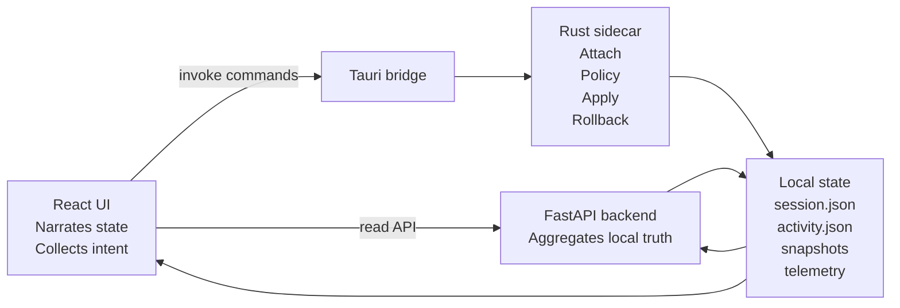
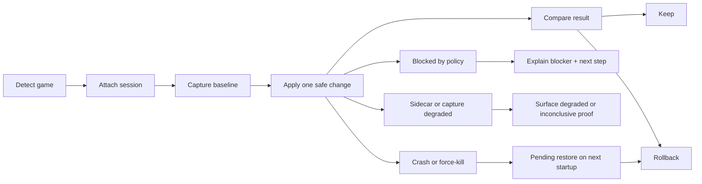

# Aeterna Human Product Transformation Audit

Extension note: this document uses `docs/AETERNA_HUMAN_PRODUCT_TRANSFORMATION_AUDIT.md` as baseline truth and focuses on synthesis, implementation doctrine, and backlog refinement against the current repo and visible UI state.

## 1. Executive diagnosis

**Facts**

- The baseline audit remains directionally correct: Aeterna already has the right authority split. UI is the narrator and action surface, Python is the aggregator, Rust sidecar is the mutation and rollback authority.
- The current repo confirms that the product is no longer a random prototype. There is a real sidecar-backed session attach flow, explicit snapshot creation, registry preset allowlist, benchmark baseline/report flow, settings persistence, and a consistent page chrome system.
- The current repo also exposes four concrete closure gaps that are now more important than adding features:
  - recommendation authority is split across `backend/services/recommendation_service.py`, `backend/services/summary_service.py`, and `core/sidecar/src/ml.rs`
  - proof is still not structurally linked to action history because `BenchmarkReport` has no `session_id`, `action_id`, or `snapshot_id`
  - rollback history is split between backend config snapshots and sidecar runtime snapshots
  - fake or sentinel timestamps still exist in fallback and disabled paths, including `"1970-01-01T00:00:00Z"`
- The current UI is calmer and more credible than generic optimizer junk. The visual language is sober, local-first, and anti-shady. The screenshots show a product that already looks more mature than the underlying closure actually is.
- The strongest subsystem remains constraint integrity.
- The weakest subsystem remains proof linkage and trust closure.

**Interpretation**

- Aeterna is in the dangerous middle state: it is now serious enough that inconsistency matters more than missing features.
- The next milestone is not a feature milestone. It is a closure milestone.
- The product will win or lose on whether the user can move through one coherent loop:
  - understand current session state
  - attach intentionally
  - capture baseline
  - test one reversible change
  - compare result
  - keep or rollback
- If Aeterna keeps adding surfaces without closing proof, activity, and blocked-state logic, it will become high-effort slop: thoughtful, polished, still not fully trustworthy.

**Recommendations**

- Treat the next 6-8 weeks as a product-integrity program.
- Freeze the public truth model now:
  - Aeterna is a trust-first session control product
  - proof is baseline -> change -> compare -> rollback
  - automation is bounded authority, not magic
  - ML is advisory and must declare runtime truth honestly
- Make the following five items non-negotiable before broadening scope:
  - unify next-action authority
  - bind proof to session and action history
  - make blocked states close with one reason and one next step
  - unify restore history into one trust narrative
  - remove fake dates and placeholder truth leakage

**Experiments**

- Run a 10-minute operator test with only one prompt: "Attach a session, prove one change, undo it."
- Run a "hostile trust" review where a skeptical player tries to find every place where the UI sounds stronger than the runtime actually is.
- Compare completion time before and after unifying next-action authority on Dashboard and Optimization.

**Acceptance Criteria**

- A new user can understand the product truth in one sentence: "Aeterna helps you prove one reversible session change at a time."
- No screen forces the user to reconcile conflicting advice from multiple recommendation sources.
- No successful-looking tweak exists without an adjacent proof state or an explicit statement that proof is missing.

## 2. System architecture and trust boundaries

**Facts**

- The runtime currently has five practical layers:
  - Tauri shell and startup lifecycle
  - React/TypeScript UI
  - FastAPI aggregation and persistence layer
  - Rust sidecar runtime authority
  - local storage surfaces for telemetry, settings, snapshots, models, and build metadata
- The current authority split is mostly right:
  - UI requests actions and renders state
  - backend reads, aggregates, persists, and formats
  - sidecar detects, mutates, restores, and enforces runtime policy
- Data flow today is:
  - sidecar writes session state, runtime activity, telemetry, and runtime snapshots
  - backend reads local files and exposes bootstrap/dashboard/settings/benchmark/model payloads
  - UI hydrates from bootstrap, then combines backend payloads with direct sidecar inspection and sidecar actions
- Action flow today is:
  - UI previews a tweak or registry preset
  - user confirms in preview modal
  - UI invokes Tauri command
  - sidecar validates policy, writes snapshot, applies mutation, appends activity, returns fresh runtime state
  - backend reload is then used to refresh derived summaries and benchmark state
- Rollback flow today is:
  - UI invokes rollback with snapshot id
  - sidecar restores process state, power plan, and registry entries
  - sidecar marks snapshot restored and appends activity
- The architecture has two notable trust-boundary leaks:
  - snapshot truth is split: backend config snapshots and sidecar runtime snapshots use different schemas and different UX surfaces
  - recommendation truth is split: backend summary, dashboard heuristics, and sidecar ML inference can all influence the same screen

**Interpretation**

- The system already has the right trust boundaries. It should not be replatformed.
- The product problem is not architecture inversion. The product problem is that the current architecture is not yet synthesized into one user-facing authority model.
- The sidecar must remain the only mutation authority for:
  - session attach and end
  - process priority and affinity
  - power plan changes
  - registry presets
  - auto-restore and crash-safe restore
- The backend should become stricter, not broader. It should be the evidence and presentation API, not a second mutation engine.

**Recommendations**

- Formalize one shared user-facing state model and make every page consume it.
- Keep responsibilities explicit:

| Layer | What must live here | Why |
| --- | --- | --- |
| UI | page chrome, primary question, next action, preview and consent surfaces, state copy mapping, progressive disclosure | this is where human comprehension is created |
| Backend | bootstrap payloads, dashboard summaries, benchmark persistence, profile matching, settings persistence, build/runtime aggregation | this is read-heavy synthesis and local persistence |
| Sidecar | attach, inspect, apply, rollback, telemetry capture, policy enforcement, registry snapshot engine, runtime activity stream | this is the only trustworthy mutation and restore authority |
| Tauri shell | sidecar/backend lifecycle, startup diagnostics, desktop bridge | this is orchestration, not product logic |

- Add an explicit `DecisionState` or `SessionDecision` object returned by backend summary routes and reused by Dashboard and Optimization:
  - `primary_status`
  - `next_action`
  - `primary_blocker`
  - `proof_state`
  - `evidence_mode`
  - `recommended_profile`
  - `active_restore`
- Replace split recommendation authority with one ordered source of truth:
  - session and proof gates from sidecar and benchmark state
  - profile recommendation from backend profile service
  - ML recommendation only as advisory reasons inside that decision object

### Critical Path

- Detect game
- Attach session
- Capture baseline
- Apply one safe preset
- Compare
- Keep or rollback

### Failure Path

- sidecar unavailable
- backend unavailable
- build metadata unavailable
- snapshot load failure
- restore failure

Required user-facing contract:

- current state
- what is unavailable
- what remains safe
- one next recovery action

### Fallback Path

- live telemetry unavailable -> degraded live
- model artifact unavailable -> fallback
- no profile match -> generic safe path
- manual process tools -> fallback, not default

Required wording:

- `Live`
- `Degraded live`
- `Demo`
- `Unavailable`

### Blocked Path

- optimizer disabled
- session not attached
- baseline missing
- pending registry restore
- allowlist or automation rule not enabled
- admin consent denied

Required wording:

- one blocker
- one reason
- one next step

### State Model

| Axis | Current raw states | Required public state |
| --- | --- | --- |
| Evidence mode | `demo`, `live`, `disabled`, `counters-fallback`, `presentmon`, `idle`, `warming`, `ready`, `degraded` | `Demo`, `Live`, `Degraded live`, `Unavailable` |
| Session mode | `idle`, `detected`, `attached`, `active`, `ended`, `restored` | `No session`, `Game detected`, `Session attached`, `Session active`, `Session ended`, `Session restored` |
| Optimizer authority | feature flag `network_optimizer` plus automation settings | `Optimizer off`, `Manual`, `Assisted`, `Trusted profiles` |
| Baseline state | absent or stored baseline | `Baseline required`, `Baseline ready`, `Compare ready` |
| Allowlist state | allowed / blocked in policy | `Allowed now`, `Blocked by policy` |
| Restore state | `auto_restore_pending`, `pending_registry_restore` | `Clean`, `Undo ready`, `Restore pending`, `Admin restore required` |
| Model runtime | registry entries plus sidecar fallback metadata | `ONNX`, `Fallback`, `Unavailable` |

**Experiments**

- Create one internal state matrix of all action affordances by combined state.
- Simulate force-kill after registry apply and verify the pending restore path against the public copy model.

**Acceptance Criteria**

- An engineer can answer in under 30 minutes where session truth, policy truth, proof truth, and rollback truth originate.
- No page invents a product state that does not exist in a shared contract.
- UI never exposes raw implementation state when a human-readable derived state already exists.

## 3. Human product vs AI slop criteria

**Facts**

- Current Aeterna already avoids several slop markers:
  - no hack-tool aesthetic
  - no memory-edit or anti-cheat theater
  - explicit rollback framing
  - local-first defaults
  - allowlist language around registry presets
- Current Aeterna still shows several slop markers:
  - repeated large chrome and explanatory subtitles on every route
  - multiple equal-weight cards above the fold
  - recommendation surfaces with different authorities
  - technical capture and fallback terms surfaced too early
  - some static doctrine text occupying primary screen real estate

**Interpretation**

- The product is not junk. The risk is subtler: it can still feel like a well-written concept app instead of a controlled operating tool.
- Human-centered here does not mean friendly filler. It means compressed truth, controlled friction, clear next step, and inspectable reversibility.

**Recommendations**

Use the following quality bar on every merge:

| Criterion | Human product behavior | AI slop behavior | Current status |
| --- | --- | --- | --- |
| Truth | declares live, degraded, fallback, demo honestly | rounds everything up to "working" | partial |
| Control | attach, apply, compare, rollback are explicit | hidden automation and vague outcomes | good |
| Reversibility | every risky action shows restore path | rollback is implied but not operational | good with gaps |
| Proof | evidence tied to action | benchmark sits nearby but disconnected | weak |
| Feedback loops | product learns from helped / not helpful / no effect | no loop or only passive telemetry | missing |
| Cognitive clarity | one main question and one next action | many medium-weight cards | mixed |
| Constraint integrity | hard boundaries enforced in runtime | marketing copy does the guarding | strong |
| Naming consistency | same concept named the same everywhere | logs/activity, improved/better, fallback variants drift | mixed |
| Automation calibration | bounded and explained inline | auto actions feel spooky | partial |
| ML honesty | runtime truth outranks model branding | inference page oversells maturity | partial |

**Experiments**

- Add a "slop smell" review checklist to PRs and require explicit sign-off when a screen gains a new card or status label.
- Run a 5-second glance test on every route: ask what the current state is, what the next action is, and why the user should trust it.

**Acceptance Criteria**

- No screen ships if it fails more than three slop-smell checks.
- No route requires reading more than one medium paragraph to understand the next action.

## 4. Current-state critique of Aeterna

**Facts**

- Truth: architecture truth is stronger than UX truth. The repo contains correct boundaries, but UI still reconciles three recommendation authorities and two snapshot stories.
- Control: strong. The product already insists on preview, consent, policy gating, and rollback for high-risk actions.
- Reversibility: strong for sidecar tweaks and promising for registry, but the restore story is still fragmented across runtime and settings-level snapshots.
- Proof: benchmark exists, but proof is not linked to the action that created the hypothesis.
- Feedback loops: absent. There is no shipped per-recommendation feedback event system.
- Cognitive clarity: improved versus baseline, but above-the-fold density is still too even.
- Constraint integrity: strongest part of the product. Sidecar and policy code are more mature than the UX closure.
- Naming consistency: mixed. Examples:
  - route label is `Activity`, internal page id is `logs`
  - public benchmark doctrine wants `better/mixed/worse/inconclusive`, current code uses `improved/mixed/regressed`
  - `network_optimizer` internally now means broader optimizer authority, not a network-specific feature
- Trust architecture: good bones, weak closure.
- Automation calibration: bounded in code, under-explained in the UI.
- ML honesty: better than average, but still split between registry-driven model catalog and sidecar fallback inference.

**Interpretation**

- The product's strongest advantage is not "more tweaks." It is disciplined refusal.
- The product's current failure mode is not dishonesty by intent. It is trust drift through inconsistent surfaces.
- The most dangerous contradictions are:
  - attach is currently disabled in the Optimization page when optimizer authority is off, even though attach should remain available for inspection and baseline capture
  - benchmark baseline and compare can exist without structural linkage to session/action history
  - Models can show no active model while sidecar fallback inference still produces recommendation output

**Recommendations**

### Product critique by system axis

| Axis | Brutally honest read | What changes now |
| --- | --- | --- |
| Truth | good engine, uneven narration | create one shared decision contract and one shared state copy registry |
| Control | already above category average | keep attach and inspect available even when mutation authority is off |
| Reversibility | real, but split | unify runtime and config restore stories under one history taxonomy |
| Proof | present but weakly attached | bind compare to snapshot/action/session and show verdict inline |
| Feedback loops | nearly absent | add granular recommendation feedback immediately after compare or dismissal |
| Cognitive clarity | calm visuals, too many equal surfaces | compress chrome, create one main action ladder |
| Constraint integrity | excellent | preserve as product identity, not just implementation detail |
| Naming consistency | mixed | normalize public lexicon and remove stale internal names from UI |
| Trust architecture | conceptually strong | operationalize blocked, fallback, restore, and proof links everywhere |
| Automation calibration | good hidden logic, weak visible logic | disclose why allowed, what rule, what auto-restores |
| ML honesty | better than most apps, not yet closed | make fallback authority explicit and reduce catalog prominence |

### Current page critique

| Page | One-sentence promise | Must prove | Must block | Above the fold | Details | What feels human now | What feels like slop now | Remove | Restructure |
| --- | --- | --- | --- | --- | --- | --- | --- | --- | --- |
| Dashboard | "Tell me whether this session is healthy and what to do next." | current session state, next step, last proof verdict | false confidence when proof is missing | primary status, next action, last verdict | secondary recommendations, extra metrics | frametime chart and proof framing | recommendation and proof do not always collapse into one CTA | repeated explanatory filler | make primary recommendation a real action row with destination |
| Optimization | "Let me test one reversible change safely." | attached scope, blocker, current best test, proof readiness | unsafe apply without baseline or attach | session card, action ladder, compare state | registry presets, manual tools, recent activity | preview modal and rollback framing | too many equal cards, fallback/manual tools compete with main flow | duplicated blocker copy | vertical ladder: attach -> baseline -> one change -> compare -> rollback |
| Security | "Show why this product is safe to use." | current exposure and enabled authority | false anti-cheat theater | current exposure, current posture, active authorities | static boundaries and guidance | explicit refusal language | too much static doctrine text | any warning not tied to current state | tie posture to current enabled capabilities and current session |
| Models | "Tell me how much I should trust the recommendation layer." | runtime mode, reason source, uncertainty | model-branding inflation | current recommendation authority, runtime mode, what not to trust | catalog and artifacts | unusually honest copy | catalog still outranks current trust question | admin-style controls from top of page | promote active runtime truth and demote catalog |
| Activity | "Show what changed and whether I can undo it." | session narrative, undo status, last blocked/failed event | hidden restore ambiguity | latest session story, undo count, last important event | raw logs and filters | trust-first framing of rollback | proof links are empty, config/runtime history split | raw proof placeholder text | group events by session and add proof/blocked events |
| Settings | "Show what authority I have granted Aeterna." | current authority summary and data retention | invisible authority creep | authority summary, automation mode, telemetry mode | toggles and diagnostics | local-only and allowlist framing | toggle cemetery effect | static principle text that does not affect decisions | summarize authority first, then reveal toggles |

**Experiments**

- Run a per-page 5-second comprehension test with current screenshots and again after primary action/evidence zoning.
- Track which page users open before their first baseline capture. If Dashboard is not the entry point into the primary flow, its CTA is not clear enough.

**Acceptance Criteria**

- Every page can be answered in 3-5 seconds:
  - what is happening now
  - what can I do next
  - why should I trust this
- No page ships with more than one unresolved contradiction between copy and runtime behavior.

## 5. Information architecture redesign

**Facts**

- The existing route set is already correct enough. The product does not need new primary routes.
- The current page chrome contract already approximates the right shape:
  - eyebrow
  - title
  - subtitle
  - badges
  - question
- The current sidebar and repeated page chrome consume too much above-the-fold attention relative to the primary workflow.

**Interpretation**

- IA does not need expansion. It needs sharpening.
- The user should feel like they are moving through one operating loop, not six parallel essays.

**Recommendations**

### One primary flow

1. Detect game
2. Attach session
3. Capture baseline
4. Apply one safe change
5. Compare result
6. Keep or rollback

### Route jobs

| Route | Core job | Secondary job |
| --- | --- | --- |
| Dashboard | session decision surface | launch the next step |
| Optimization | main action surface | host preview, compare, rollback |
| Security | trust boundary surface | explain current risk and active authority |
| Models | recommendation authority surface | show why and when not to trust ML |
| Activity | trust history surface | reconstruct session story and undo path |
| Settings | authority and retention surface | manage consent and diagnostics |

### Page-by-page flow

| From | To | Trigger |
| --- | --- | --- |
| Dashboard | Optimization | attach, baseline, compare, rollback CTA |
| Optimization | Activity | applied, blocked, restored, or failed action |
| Optimization | Security | user questions safety or blocker cause |
| Optimization | Models | user questions recommendation authority |
| Settings | Optimization | after enabling authority required for action |

### Zone contract by screen

| Screen | Action zone | Evidence zone | Trust zone | Detail zone |
| --- | --- | --- | --- | --- |
| Dashboard | next step CTA | session health and last proof | evidence mode and profile trust | secondary recs and stats |
| Optimization | attach/baseline/change/compare ladder | compare panel and live status | preview trust contract and blocker | registry catalog and manual tools |
| Security | current posture action | current exposure and enabled authority | hard boundaries | longer rationale |
| Models | recommendation authority | top reasons and runtime mode | uncertainty and "do not trust yet" | catalog and artifact details |
| Activity | undo and restore actions | session timeline and proof links | failure/blocked causes | developer diagnostics |
| Settings | authority toggles that matter now | summary of current authority | consent, retention, auto-restore policy | build and debug details |

### Naming system

Public naming should use:

- `Dashboard` nav label, page title `Session status`
- `Optimization` nav label, page title `Test one change`
- `Security` nav label, page title `Safety boundaries`
- `Models` nav label, page title `Recommendation confidence`
- `Activity` nav label, page title `Session history`
- `Settings` nav label, page title `Authority and data`

Replace or hide these terms from primary surfaces:

- `counters fallback` -> `Degraded live`
- `policy blocked` -> `Blocked`
- `operator stance` -> `Trust guidance`
- `rollback history` -> `Session history`
- `improved/regressed` -> `Better/Worse`
- internal `logs` route naming -> `activity`
- internal `network_optimizer` concept -> `performance optimizer`

Extend page chrome contract to:

- `eyebrow`
- `title`
- `subtitle`
- `decision_badges`
- `primary_question`
- `next_action`

**Experiments**

- Collapse non-Dashboard chrome after the user enters the primary flow and measure scroll depth and first-action time.
- Test whether replacing metaphoric page titles (`Control room`) with task titles (`Session status`) improves 5-second comprehension.

**Acceptance Criteria**

- The user can explain what each route is for without reading documentation.
- Every route contains one clear action zone and one clear evidence zone.

## 6. Screen-by-screen redesign doctrine

**Facts**

- The current UI already has a coherent visual system: soft borders, rounded containers, restrained palette, and non-shady typography.
- The current visual problem is hierarchy, not style. Too many panels share similar weight, and chrome repeats the same pattern on every page.

**Interpretation**

- The correct visual move is compression and emphasis, not a full redesign.
- The product should feel like a disciplined instrument panel, not a card gallery.

**Recommendations**

### Dashboard doctrine

- Promise: answer whether the current session is healthy enough to keep playing.
- Above the fold:
  - session status
  - evidence mode
  - next action button
  - latest proof verdict
- Layout:
  - left: current session and last proof
  - right: one next-action module with explicit destination
- Remove:
  - duplicate advisory text that does not change the decision
  - multiple secondary recommendations above the fold
- Add:
  - hard CTA that routes to Optimization with context
  - verdict strip showing `Better`, `Mixed`, `Worse`, or `No proof yet`

### Optimization doctrine

- Promise: let the user test one reversible change.
- Above the fold:
  - current attached session
  - blocker or authority status
  - baseline state
  - recommended safe change
  - compare button or restore button
- Reorder into ladder:
  - Step 1: attach
  - Step 2: baseline
  - Step 3: preview change
  - Step 4: compare
  - Step 5: keep or rollback
- Registry presets live below the main ladder as a dedicated `System presets` block.
- Manual process tools collapse into fallback details.
- Preview modal must show:
  - current state
  - target state
  - policy status
  - rollback path
  - admin requirement
  - blocking reason if blocked
  - advanced registry details only inside expert foldout

### Security doctrine

- Promise: show why the product remains safe on a real gaming machine.
- Above the fold:
  - current risk posture
  - why current posture is what it is
  - current enabled authorities
- Hard boundaries move below the fold and remain static.
- Replace generic caution text with current-state exposure:
  - live telemetry on/off
  - automation mode
  - system presets allowed/disallowed
  - restore pending yes/no

### Models doctrine

- Promise: tell the user how much recommendation authority is real.
- Above the fold:
  - active recommendation authority
  - runtime mode
  - confidence wording
  - top reasons
  - what not to trust yet
- Catalog becomes a details surface, not the hero.
- If no ONNX-backed model is active, the headline should still be honest even if fallback metadata inference exists.

### Activity doctrine

- Promise: reconstruct what changed and whether it can be undone.
- Above the fold:
  - latest important event
  - undo-ready count
  - last blocked or failed event
  - last proof verdict
- Timeline grouped by session:
  - session attached
  - baseline captured
  - tweak applied
  - compare verdict
  - restored or kept
- Developer logs become clearly secondary support output.

### Settings doctrine

- Promise: show the authority and data posture the user granted.
- Above the fold:
  - authority summary sentence
  - automation mode
  - telemetry mode
  - registry preset capability
  - retention mode
- Settings sections become exactly four:
  - Privacy
  - Automation authority
  - Session behavior
  - Diagnostics and build state
- The product should summarize consequences, not just list toggles.

**Experiments**

- Prototype a compact chrome mode for all non-Dashboard pages.
- Measure whether collapsing manual tools by default increases baseline capture and compare completion.

**Acceptance Criteria**

- No page feels like "read the cards."
- Every page has one dominant action or conclusion above the fold.
- Screens remain sober and credible without turning into sparse conceptual art.

## 7. Benchmark / proof architecture

**Facts**

- Current benchmark model exists and already captures baseline, current, delta, verdict, and summary.
- Current verdicts are `improved`, `mixed`, `regressed`.
- Current proof gaps are structural:
  - no `session_id`
  - no `action_id`
  - no `snapshot_id`
  - no `evidence_quality`
  - no `recommended_next_step`
- Current benchmark flow can run without binding the proof to the exact action being evaluated.

**Interpretation**

- Benchmark is already the product's most important value engine.
- Right now benchmark proves "something changed in a time window," not "this exact action on this exact session produced this exact result."
- That is the single most important product integrity gap left in the repo.

**Recommendations**

### Benchmark contract

Add or normalize these fields:

- `id`
- `session_id`
- `action_id`
- `snapshot_id`
- `profile_id`
- `evidence_mode`
- `evidence_quality`
- `baseline`
- `current`
- `delta`
- `verdict`
- `summary`
- `recommended_next_step`
- `captured_after_action_at`

### Benchmark payload semantics

| Field | Meaning |
| --- | --- |
| `baseline` | reference window captured before the tested change |
| `current` | window captured after the tested change |
| `delta` | signed metric movement |
| `verdict` | `better`, `mixed`, `worse`, or `inconclusive` |
| `summary` | one-line trust statement |
| `recommended_next_step` | keep, rollback, retest, or gather more evidence |

### Verdict logic

Use these five primary metrics:

- `fps_avg`
- `frametime_p95_ms`
- `frame_drop_ratio`
- `cpu_total_pct`
- `background_cpu_pct`

Public verdict rules:

- `Better`
  - frametime p95 improves materially
  - at least two other primary metrics improve
  - no severe regression in another primary metric
- `Mixed`
  - evidence contains real tradeoffs and quality is acceptable
- `Worse`
  - frametime p95 worsens materially or multiple primary metrics regress
- `Inconclusive`
  - degraded evidence quality
  - too few samples
  - session mismatch
  - baseline and current not comparable

### Compare surface behavior

- Compare belongs beside the action that created the hypothesis.
- After apply, Optimization enters a `proof pending` state.
- The same component should then show:
  - the action being tested
  - baseline status
  - compare CTA
  - final verdict
  - keep or rollback CTA

### Honest "no proof" wording

Use only these variants:

- `No proof yet. Capture a baseline first.`
- `No proof yet. Baseline is ready, but this change has not been compared yet.`
- `Proof is inconclusive. The data quality was too weak to trust this result.`

**Experiments**

- Add `inconclusive` and track how often verdict quality degrades under fallback telemetry.
- Test whether explicit `proof pending` state improves compare completion after applying a change.

**Acceptance Criteria**

- No tweak can appear successful without an adjacent proof state.
- Every benchmark verdict can be traced to one session and one tested action.
- The product can say "we do not have proof" without sounding broken.

## 8. Profile system design

**Facts**

- The repo already contains the minimum five priority profiles:
  - CS2
  - Valorant
  - Fortnite
  - Apex Legends
  - Warzone
- Current profiles are mostly descriptive, with `safe_preset`, `expected_benefit`, `risk_note`, `benchmark_expectation`, and `allowed_actions`.
- Detection is currently substring-based. That is acceptable for now, but public trust should not depend on detection sounding smarter than it is.

**Interpretation**

- The profile subsystem is moving in the right direction.
- It still reads too much like an internal catalog and not enough like a user-facing session mode.

**Recommendations**

### Profile recommendation contract

For each profile return:

- `recommended_profile`
- `why_this_profile`
- `safe_preset`
- `allowed_actions`
- `expected_benefit`
- `risk_note`
- `benchmark_expectation`
- `expected_proof`

### Priority profiles

| Game | Safe preset | Expected benefit | Risk note | Benchmark expectation | Allowed actions | Why this profile |
| --- | --- | --- | --- | --- | --- | --- |
| CS2 | Attach session, raise priority first, use session-scoped power plan second, balanced affinity only if contention stays high | cleaner frametime pacing and lower desktop contention | aggressive affinity reduction is not default-safe | p95 frametime should improve before FPS meaningfully changes | priority, affinity, power plan | CPU contention and background noise usually matter more than raw GPU load |
| Valorant | Manual or Assisted only, priority first, no aggressive stacking, benchmark before any second action | safer session stabilization under stricter anti-cheat expectations | avoid expanding authority until local proof exists | background CPU and p95 should improve together | priority, power plan | compatibility posture matters more than optimizer ambition |
| Fortnite | priority first, balanced affinity only if streaming spikes remain, compare after each change | steadier pacing under variable streaming load | small FPS gains do not matter if frame drops worsen | frame-drop ratio and background pressure should both decline | priority, affinity, power plan | session load is bursty and benefits from controlled scheduler cleanup |
| Apex | priority first, balanced affinity only if CPU-heavy after proof | lower anomaly score and steadier pacing in fights | stacking changes without compare destroys attribution | anomaly score and frame-drop ratio should move down | priority, affinity | the problem is often noise and contention, not one obvious knob |
| Warzone | session-scoped power plan plus priority, affinity only if whole-system CPU pressure stays elevated | reduced whole-system contention during heavy matches | short FPS spikes are not trustworthy proof | CPU contention and p95 must improve together | priority, affinity, power plan | heavy-load sessions need stabilization more than aggressive tuning |

### UX rule

- Profiles must look like "recommended session modes," not entities.
- If no profile matches:
  - say `No matched profile`
  - keep the generic safe path visible
  - benchmark outranks any generic preset

**Experiments**

- Measure attachment-to-profile-match rate by game.
- Add a user-facing `Why this profile` line and test whether trust in recommendations improves.

**Acceptance Criteria**

- Profiles feel like real gaming session guidance.
- A user can understand why a profile appeared without reading implementation details.
- No profile is trusted more than the benchmark.

## 9. ML reality and explainability doctrine

**Facts**

- Sidecar inference currently exists even when the backend model catalog is empty because `core/sidecar/src/ml.rs` can fall back to metadata-derived scoring.
- Models page currently reads backend model registry state, not necessarily the exact runtime authority that produced the current recommendation.
- The result is a truth split:
  - recommendation behavior can be present
  - model catalog can still look empty
- Current feedback mechanisms do not let the product learn from user judgment of recommendations.

**Interpretation**

- The ML layer is not fake, but it is not yet product-closed.
- The product currently risks an unnecessary trust wound: "Why did you recommend something if you say no model is active?"
- The right posture is not to hide fallback. The right posture is to reframe it as bounded advisory reasoning.

**Recommendations**

### ML reality contract

Return one shared recommendation authority object:

- `active_model`
- `runtime_mode`
- `confidence_behavior`
- `why_recommendation_appeared`
- `signal_sources`
- `what_not_to_trust_yet`
- `uncertainty_state`

Runtime mode values:

- `ONNX`
- `Fallback`
- `Unavailable`

Confidence wording:

| Runtime mode | Confidence wording |
| --- | --- |
| ONNX | `Runtime-backed recommendation` |
| Fallback | `Fallback recommendation` |
| Unavailable | `No recommendation authority` |

### Explainability design

For each recommendation show:

- top 2-3 reasons
- signal source labels:
  - `Live telemetry`
  - `Degraded telemetry`
  - `Profile match`
  - `Recent benchmark`
  - `Fallback model`
- confidence wording:
  - `High enough to test`
  - `Advisory only`
  - `Too uncertain`
- explicit boundary:
  - `Do not trust this as proof. Run Compare after the change.`

### When to show uncertainty

- evidence is degraded
- no active model artifact
- recommendation is fallback-only
- session is not attached
- baseline is missing

### When to say "we don't know"

- there is no matched profile and no runtime-backed recommendation
- telemetry is disabled or unavailable
- sample size is too small

### Feedback event contract

Add:

- `action_id`
- `session_id`
- `recommendation_id`
- `feedback_label`
- `reason`
- `suggest_again`

Feedback labels:

- `helped`
- `not_helpful`
- `too_risky`
- `unclear`
- `no_effect`
- `do_not_suggest_again`

### Why this improves the product

- trust: recommendation authority becomes inspectable
- learning loops: user feedback can refine profiles and ranking
- recommendation quality: repeated bad recs can be dampened
- usefulness: the product learns what actually survives compare and keep

**Experiments**

- Add a temporary UI flag that suppresses all recommendation copy when runtime mode is `Unavailable`, then test whether users still complete the flow.
- Measure helpful/not-helpful feedback by runtime mode to quantify how much value ONNX or fallback actually adds.

**Acceptance Criteria**

- The product never implies model authority that the runtime cannot justify.
- Every recommendation can explain why it appeared and what not to trust yet.
- Users can express "too risky" and "no effect" without leaving the main flow.

## 10. Automation authority model

**Facts**

- Current settings already include `manual`, `assisted`, and `trusted_profiles`.
- Current allowlist is per action:
  - process priority
  - CPU affinity
  - power plan
- Registry presets are already manual-only in first-release doctrine.

**Interpretation**

- The foundation is right, but the visible product model is still too toggle-driven.
- Automation should feel like calibrated delegation, not hidden initiative.

**Recommendations**

### Public automation model

| Mode | What Aeterna may do | What it may never do |
| --- | --- | --- |
| Manual | suggest only | act without explicit confirmation |
| Assisted | preselect and queue approved session-scoped actions | bypass consent, apply registry presets automatically |
| Trusted profiles | auto-apply allowlisted session-scoped non-registry actions only when profile match and local policy both pass | act outside allowlist or on unmatched sessions |

### Every automated action must show

- why allowed
- which allowlist rule allowed it
- what will auto-restore
- what risk remains
- how to disable it

Suggested inline disclosure:

- `Allowed because Assisted mode is on and "Raise process priority" is in your allowlist.`
- `Auto-restore: original priority will be restored when the session ends.`
- `Remaining risk: proof still required before you keep this change.`
- `Disable: Settings -> Automation authority`

### Policy disclosure contract

Add:

- `automation_mode`
- `rule_id`
- `rule_label`
- `restore_policy`
- `residual_risk`
- `disable_path`

### Product behavior rules

- Attach and baseline are never blocked by automation being off.
- Automation must never outrank proof.
- Trusted profiles must still show what they did in Activity immediately.

**Experiments**

- Test whether users understand Assisted vs Trusted profiles without reading a help page.
- Track whether trust conversion rises when auto actions disclose the exact allowlist rule.

**Acceptance Criteria**

- Automation never looks magical.
- Users can answer "why was this allowed?" for any auto action.
- Registry presets stay manual-only in the current cycle.

## 11. Activity / rollback trust model

**Facts**

- Current sidecar `ActivityEntry` includes category, action, detail, risk, snapshot id, session id, proof link, and blocked status.
- Current proof links are not populated.
- Current event taxonomy is still incomplete and inconsistent.
- Current settings snapshot history and sidecar runtime activity are split across different stores and UI surfaces.

**Interpretation**

- Activity is the natural center of trust, but it is not yet the center of truth.
- The user should never have to guess whether a change was runtime, configuration, proof-related, blocked, or restored.

**Recommendations**

### Event taxonomy

- `session`
- `tweak`
- `proof`
- `restore`
- `failed`
- `blocked`
- `registry`
- `registry-restore`
- `registry-restore-blocked`

### Every event must answer

- what changed
- why
- what proves the result
- can it be undone
- if not, why not

### Activity event contract

Add:

- `event_id`
- `category`
- `session_id`
- `action_id`
- `snapshot_id`
- `proof_link`
- `undo_available`
- `blocked_by_policy`
- `scope`
- `next_step`

### Timeline structure

Group Activity by session episode:

1. Session attached
2. Baseline captured
3. Change previewed
4. Change applied or blocked
5. Compare verdict
6. Kept or restored

### Snapshot model cleanup

- Keep backend config snapshots and sidecar runtime snapshots if necessary, but unify the history surface.
- If unified storage is too expensive now, visibly split history into:
  - `Session changes`
  - `App configuration changes`

**Experiments**

- Add grouped session episodes and test whether users can retell what happened without reading developer logs.
- Track how often users use Activity after a blocked action or after a worse verdict.

**Acceptance Criteria**

- A user can reconstruct one full session story from Activity alone.
- The difference between runtime restore and configuration restore is obvious.
- Every applied change can point to proof, explicit lack of proof, or inconclusive proof.

## 12. Safe registry preset architecture

**Facts**

- The repo already contains a real registry preset engine in sidecar code.
- It already implements the first-release allowlist:
  - `mouse_precision_off`
  - `game_capture_overhead_off`
  - `game_mode_on`
  - `power_throttling_off`
- It already captures exact rollback state using:
  - hive
  - path
  - value name
  - value type
  - old value
  - existed_before
- It already detects pending registry restore on startup via snapshot inspection.
- It already refuses arbitrary registry writing.
- The subsystem still has one product-grade defect: blocked results are returned through the same response shape with a fake snapshot fallback instead of a first-class blocked contract.

**Interpretation**

- Direction is correct. This is already far safer than generic tweak-pack behavior.
- The risk is not technical recklessness. The risk is product shape: it can still feel shady if blocked states, admin prompts, and crash-restore are not surfaced with clean user contracts.

**Recommendations**

### Architecture decisions

- Keep registry authority exclusively in Rust sidecar.
- Keep allowlist catalog versioned and static.
- Keep registry manual-only in this release.
- Keep one preset per action. No batch apply.
- Keep HKLM limited to explicit per-action UAC.

### Public sidecar commands

- `inspect_registry_presets`
- `preview_registry_preset`
- `apply_registry_preset`
- `restore_registry_snapshot`

`inspect` may still embed summary data in `OptimizationRuntimeState`, but preview should become a first-class command if the UI needs exact state and advanced details without reconstructing them ad hoc.

### Apply result contract

Use a discriminated response:

- `status: "applied"`
- `status: "blocked"`
- `status: "admin_denied"`
- `status: "restore_pending"`

Blocked result must contain:

- `blocking_reason`
- `next_step`
- `admin_required`
- `scope`

### Crash-safe restore flow

1. User applies preset
2. Sidecar writes exact snapshot
3. Sidecar applies registry mutations
4. Snapshot becomes `applied`
5. If session ends normally, restore runs automatically
6. If app crashes, startup detects pending registry snapshot
7. UI shows blocking restore banner
8. User restores now or explicitly defers
9. No new registry preset can apply while pending restore exists

### UI integration

Optimization page:

- dedicated `System presets` section below main session ladder
- each preset card shows:
  - plain-language effect
  - expected benefit
  - admin required yes/no
  - baseline required yes/no
  - current policy status
  - one blocker if blocked

Preview modal must show:

- current state
- target state
- affected values count
- user-scope vs machine-scope
- admin required yes/no
- rollback path
- advanced details foldout only on demand

Dashboard and Activity:

- show `System preset active`
- show `Restore pending`
- show `Admin restore required` when applicable

### Policy integration

Registry presets allowed only when:

- performance optimizer enabled
- session attached
- baseline exists
- no pending restore
- preset-specific conditions pass

### Not shady tweak-pack guardrails

- no raw registry editor
- no undocumented hacks
- no reboot-required presets
- no hiding raw paths behind expert branding; reveal only in advanced foldout
- no registry preset can be celebrated as success without compare

**Experiments**

- Simulate app kill after each preset type and verify restore banner behavior on startup.
- Test whether users understand the difference between user-scope and machine-scope without seeing raw registry paths by default.

**Acceptance Criteria**

- Unknown preset ids are rejected.
- No public interface can write arbitrary registry paths.
- Pending restore blocks new registry actions cleanly.
- The feature feels like controlled session infrastructure, not tweak-pack bravado.

## 13. Product demand and fit strategy

**Facts**

- Aeterna should not compete with generic optimizer junk on breadth.
- Its defensible value is:
  - trust-first
  - local-first
  - reversible
  - benchmark-backed
  - safe on real gaming machines

**Interpretation**

- The product's job is not "optimize Windows."
- The product's job is "help serious players test one session change safely and prove whether it helped."
- That value proposition is narrower and stronger than generic tweak tools.

**Recommendations**

### Who it is for

- competitive Windows FPS players who distrust optimizer junk
- players who want session-level control without memory hacking or hidden services
- creators, scrimmers, and grinders who want evidence over vibes

### What they pay attention for

- quick reading of session pressure
- controlled reversible change
- proof before committing

### Why they return

- it remembers history
- it recommends the next safe test
- it helps them keep only what proved out

### Why they trust it

- it tells them when it does not know
- it refuses more than most optimizer tools
- it always shows rollback scope

### Segments

- anti-junk optimizer skeptics
- performance tinkerers who now want guardrails
- anti-cheat-sensitive competitive players

### JTBD

- "Help me improve this session without gambling with my machine."
- "Show me whether the change actually helped."
- "Let me walk back immediately if the result is worse or unclear."

### Activation moments

- game detected
- session attached
- baseline captured

### Trust moments

- first blocked action with a good reason
- first preview modal that explains rollback
- first worse verdict that recommends rollback honestly

### Aha moments

- "It did not just suggest a tweak; it proved one."
- "It blocked the risky move until I had baseline and session context."
- "I can see exactly what changed and undo it."

### Retention hooks

- saved history of tested changes
- reliable per-game safe path
- recommendation feedback improving future suggestions

### Usefulness loops

- attach -> baseline -> test -> compare -> keep
- attach -> test -> worse -> rollback -> trust increases
- recommend -> feedback -> refine future ranking

**Experiments**

- Interview 5 users in each primary segment and ask what they currently use instead of Aeterna.
- Test whether "prove one session change" converts better than "desktop optimization" in onboarding copy.

**Acceptance Criteria**

- The product can be positioned without saying "AI" in the headline.
- Users can state a reason to return that is not "it has lots of tweaks."

## 14. Metrics and experimentation framework

**Facts**

- Current runtime telemetry exists, but product analytics for trust and usefulness are not yet formalized.
- The product already has the right conceptual funnels:
  - detection
  - attach
  - baseline
  - compare
  - rollback or keep

**Interpretation**

- Success should not be measured by clicks or time in app.
- Success should be measured by trust closure and usefulness closure.

**Recommendations**

### Core metrics

| Metric | Definition |
| --- | --- |
| Activation | `% users who reach attach after first launch` |
| Benchmark completion | `% attached sessions with baseline captured` |
| Compare completion | `% sessions with at least one post-change compare` |
| Rollback usage | `% tested changes that are undone` |
| Preset keep rate | `% tested changes kept after compare` |
| Automation adoption | `% users enabling Assisted or Trusted profiles` |
| Trust conversion | `% users who move from Manual to Assisted or Trusted after seeing proof and restore behavior` |
| Perceived usefulness | `% recommendations marked helped or kept` |
| Recommendation feedback quality | distribution of `helped`, `no_effect`, `too_risky`, `unclear`, `do_not_suggest_again` |

### Event instrumentation

- `game_detected`
- `session_attached`
- `baseline_captured`
- `change_previewed`
- `change_applied`
- `change_blocked`
- `compare_run`
- `compare_verdict_recorded`
- `change_kept`
- `change_rolled_back`
- `automation_action_executed`
- `recommendation_feedback_submitted`
- `registry_restore_pending_detected`
- `registry_restore_completed`

### Experiment cadence

- weekly trust review:
  - compare completion
  - rollback rate
  - blocked-action comprehension
- biweekly recommendation review:
  - helpful vs no-effect by game and mode
- release gate review:
  - fake timestamp defects
  - empty-card defects
  - label drift defects

**Experiments**

- Track whether showing `recommended_next_step` inside the benchmark verdict card improves keep-or-rollback completion.
- Compare onboarding paths that start in Dashboard vs Optimization.

**Acceptance Criteria**

- The team can measure whether the product is becoming more useful and more trustworthy, not just more used.
- At least one metric exists for activation, trust, usefulness, and reversibility.

## 15. Roadmap

**Facts**

- The transformation plan is already fixed into three phases over 6-8 weeks.
- The repo already contains enough working parts to execute that plan without changing the core stack.

**Interpretation**

- The roadmap should follow dependency order, not organizational preference.
- Closure work must come before broader automation or broader registry scope.

**Recommendations**

### 0-30 days

- unify next-action and proof-state authority
- normalize state copy and public verdict labels
- fix attach gating so inspection and baseline remain available when optimizer mutations are off
- bind benchmark to session and action ids
- replace registry blocked-response hack with a typed blocked result
- add authority summary in Settings
- remove fake timestamps from public UI
- rewrite stale docs: architecture and product truth

### 30-90 days

- grouped session timeline in Activity
- proof events and linked compare records
- ML reality contract and feedback loop
- page chrome compression and full action/evidence zoning
- shipped priority profiles with stronger `why_this_profile`
- release-quality dark theme tuning

### 3-6 months

- deeper ONNX runtime-backed recommendation path
- stronger telemetry quality and evidence confidence
- broader but still bounded profile intelligence
- richer per-machine trust learning from kept/rolled-back outcomes

### 6-8 week transformation sequence

| Phase | Outcome |
| --- | --- |
| Phase 1 | one trustworthy workflow and clean state/copy contract |
| Phase 2 | benchmark and profile proof become center of value |
| Phase 3 | automation, feedback, activity, and release gates productize trust |

**Experiments**

- Ship Phase 1 as a closure milestone and measure whether compare completion rises before shipping more capability.
- Delay any overlay or HUD ideas until Activity and proof closure metrics are strong.

**Acceptance Criteria**

- The next release feels materially more controlled even if it contains fewer headline features.
- Overlay or HUD work remains out of scope in this cycle.

## 16. Risks

**Facts**

- The highest risks are now product risks, not raw implementation impossibilities.

**Interpretation**

- Every major risk is a trust erosion vector.

**Recommendations**

| Risk | Why it matters | Mitigation |
| --- | --- | --- |
| Split recommendation authority | user sees conflicting advice | unify decision contract |
| Proof not linked to action | compare feels decorative | add session/action/snapshot ids to proof |
| Snapshot split | restore history feels partial | unify or clearly separate runtime vs config history |
| Fake timestamps | product looks dishonest | use null/unknown instead of sentinel dates |
| ML truth split | models page and recommendations contradict | expose runtime authority object |
| Registry perception risk | feature can look like tweak-pack behavior | strict allowlist, manual-only, proof-gated, no raw editor |
| Overly gated attach | user cannot inspect or baseline when optimizer off | decouple attach from mutation authority |
| Naming drift | users carry multiple mental models | normalize public lexicon and internal aliases |
| Documentation drift | team ships against stale truth | rewrite architecture/product truth docs now |

**Experiments**

- Run a pre-mortem for the next release: "Why would a skeptical player uninstall after one session?"
- Track all sentinel or placeholder values that still leak into public UI.

**Acceptance Criteria**

- Each top risk has an owner and a mitigation in the backlog.
- No unresolved trust-critical contradiction remains open at release candidate time.

## 17. Test plan

**Facts**

- Current automated coverage verifies only a subset of local API and telemetry mode behavior.
- Current product-critical flows around registry restore, blocked outcomes, proof linkage, and grouped history are not yet fully tested.

**Interpretation**

- The current testing posture is adequate for local development but not for a trust-first release gate.
- The most important tests are state transition and narrative integrity tests.

**Recommendations**

### Unit tests

- verdict mapping: better/mixed/worse/inconclusive
- state copy mapping by evidence mode
- policy gates for attach, baseline, registry, automation
- registry snapshot restore exactness

### Integration tests

- attach -> baseline -> apply -> compare -> rollback
- blocked apply when optimizer disabled
- blocked registry apply when no baseline
- pending registry restore on startup after forced termination
- grouped activity timeline includes proof event

### UI tests

- every blocked action shows one reason and one next step
- no raw registry paths in normal mode
- compare surface appears beside tested action
- attach remains available when mutation authority is off
- no empty cards without next action above the fold

### Manual operator tests

- 5-second comprehension per page
- hostile trust review
- forced-kill restore test
- fallback telemetry honesty test
- dark theme readability test

### Release-quality checks

- no mojibake
- no fake timestamps
- no inconsistent verdict labels
- no hidden irreversible actions
- no fallback disguised as full capability
- no proof-less tweak labeled as success
- no auto action without policy explanation
- no restore ambiguity

**Experiments**

- Add a dedicated "trust closure" checklist to release QA.
- Simulate anti-cheat-sensitive user review on Security, Optimization, and Settings only.

**Acceptance Criteria**

- The full happy path, blocked path, fallback path, and crash-restore path are all tested before release.
- The release checklist contains both engineering and UX integrity gates.

## 18. Human Product Codex

**Facts**

- The baseline audit already established the quality direction.
- The repo now needs a tighter operating constitution so future work does not reopen slop vectors.

**Interpretation**

- This codex should govern product, design, copy, and runtime decisions together.
- Trust cannot remain a theme. It has to become a merge standard.

**Recommendations**

### Principles

1. Aeterna is a trust-first session control product.
2. The user must always know current state, next step, and rollback path.
3. Reversible actions outrank clever automation.
4. Proof outranks persuasion.
5. Constraint integrity outranks capability breadth.
6. Fallback must be honest, visible, and unashamed.
7. ML is advisory unless runtime-backed and clearly explained.
8. One clear action beats six informative cards.
9. Security posture is behavior, not theater.
10. Registry actions are allowed only inside a strict allowlist.
11. Every risky action must show current -> target -> policy -> rollback.
12. Activity is a trust surface, not a dump.
13. Settings must summarize authority before listing controls.
14. If evidence is weak, say so plainly.

### Anti-principles

1. Do not ship magic.
2. Do not hide fallback behind confident wording.
3. Do not add surfaces that outrank the main workflow.
4. Do not celebrate unproven tweaks.
5. Do not make the user infer a blocked-path sequence.
6. Do not expose raw power when safe presets are enough.
7. Do not let documentation become fiction.
8. Do not let diagnostics masquerade as product value.
9. Do not add automation that the user cannot disable or understand.
10. Do not use anti-cheat-adjacent aesthetics or wording.
11. Do not use fake timestamps as placeholders.
12. Do not mix internal and public names for the same thing.
13. Do not build overlay or HUD work before trust closure.
14. Do not turn registry features into a tweak browser.

### Slop smell checklist

- more than one primary call to action
- multiple recommendation authorities on the same screen
- card added without a decision role
- confidence language stronger than evidence quality
- fallback hidden behind polished generic labels
- blocked action without one clear next step
- static doctrine text above runtime state
- proof mentioned but not linked

### UX checklist

- what is happening now
- what can I do next
- why is this available or unavailable
- what will be restored automatically
- where is the evidence
- what remains uncertain

### AI honesty checklist

- runtime mode disclosed
- fallback disclosed
- no active model disclosed
- reasons surfaced
- uncertainty surfaced
- "we do not know" surfaced when appropriate

### Safety and rollback checklist

- snapshot exists before apply
- restore path visible before consent
- scope visible
- admin requirement visible
- pending restore blocks new risk
- activity records apply and restore

### Proof/value checklist

- baseline exists
- compare is adjacent to tested change
- verdict language normalized
- recommended next step exists
- keep or rollback action exists after verdict

### Microcopy templates

- Warning: `This change is allowed, but proof comes only after Compare.`
- Uncertainty: `The recommendation is advisory only. Evidence is limited.`
- Blocked action: `Blocked. Capture a baseline first.`
- Consent: `Aeterna will create a rollback snapshot before applying this change.`
- Manual-only: `This action stays manual in this release.`
- Fallback: `Recommendation is running in fallback mode. Treat it as guidance, not proof.`
- Degraded: `Live telemetry is degraded. Compare results may be inconclusive.`
- Baseline required: `Capture a baseline before testing this change.`
- Rollback available: `You can undo this immediately or when the session ends.`
- Admin required: `This action needs administrator approval for this one step only.`

### Quality gates

- no fake timestamps
- no mojibake
- no empty cards without next action
- no inconsistent labels
- no hidden irreversible actions
- no unbounded registry writes
- no fallback disguised as full capability
- no proof-less tweak marked as success
- no auto action without policy explanation
- no restore path ambiguity

### User research plan

- weekly 5-second comprehension tests
- biweekly operator interviews with competitive FPS users
- hostile trust review before release candidate
- compare-kept vs compare-rolled-back follow-up interviews

### Engineering implementation plan

- shared decision contract
- proof linkage contract
- unified activity taxonomy
- registry blocked-result contract
- state copy registry
- authority summary and naming cleanup

### 0-30 / 30-90 / 3-6 month roadmap

- 0-30: closure and copy contracts
- 30-90: trust history, feedback, ML authority, phase-3 polish
- 3-6 month: deeper telemetry, ONNX maturity, profile intelligence

### Risks and mitigations

- trust drift -> shared contracts and review gates
- registry perception risk -> manual-only, allowlist, proof-gated
- ML oversell -> runtime authority object and honesty checklist

### Test plan

- happy path
- blocked path
- fallback path
- crash-restore path
- visual hierarchy review

### Definition of Done for "not raw"

Aeterna is "not raw" when:

- each route has one clear job
- attach -> baseline -> test -> compare -> rollback works without docs
- blocked states close with one reason and one next step
- proof links to action history
- automation explains itself
- registry presets feel controlled, reversible, and narrow
- fallback never pretends to be fully live
- Activity tells one coherent session story
- release gates catch credibility defects before ship

**Experiments**

- Use the codex as a PR template for two sprints and review which rules prevent actual regressions.

**Acceptance Criteria**

- The team can use this codex as an operating constitution.
- New work can be rejected for violating trust and proof rules even if it is technically impressive.

## 19. Concrete implementation backlog

**Facts**

- The repo already contains most primitives needed for transformation.
- The most valuable work now is contract cleanup, state synthesis, and trust closure.

**Interpretation**

- This backlog should be executed by dependency order.
- The top priority is not more capability. It is fewer contradictions.

**Recommendations**

### P0: closure and truth alignment

| ID | Task | Layer | Candidate files | Outcome |
| --- | --- | --- | --- | --- |
| P0.1 | Create shared `DecisionState` contract for Dashboard and Optimization | backend + UI | `backend/services/summary_service.py`, `backend/services/recommendation_service.py`, `backend/schemas/api.py`, `app/src/types.ts`, `app/src/pages/DashboardPage.tsx`, `app/src/pages/OptimizationPage.tsx` | one next action authority |
| P0.2 | Decouple attach/inspect from optimizer mutation enable | UI + policy | `app/src/pages/OptimizationPage.tsx`, `core/sidecar/src/policy.rs` | user can attach and baseline even when mutation authority is off |
| P0.3 | Bind `BenchmarkReport` to `session_id`, `action_id`, `snapshot_id`, `recommended_next_step`, `evidence_quality` | backend + UI | `backend/schemas/api.py`, `backend/services/benchmark_service.py`, `app/src/types.ts`, `app/src/pages/OptimizationPage.tsx`, `app/src/pages/LogsPage.tsx` | proof linkage |
| P0.4 | Normalize public verdict labels to `better/mixed/worse/inconclusive` | backend + UI | same files as P0.3 plus `app/src/lib/stateCopy.ts` | public naming consistency |
| P0.5 | Replace registry blocked-response hack with typed blocked result | sidecar + UI | `core/sidecar/src/models.rs`, `core/sidecar/src/main.rs`, `app/src/lib/sidecar.ts`, `app/src/App.tsx` | clean blocked path |
| P0.6 | Unify history taxonomy or clearly split runtime vs config history | backend + sidecar + UI | `core/sidecar/src/activity.rs`, `core/sidecar/src/snapshots.rs`, `backend/services/snapshot_service.py`, `app/src/pages/LogsPage.tsx`, `app/src/pages/SettingsPage.tsx` | one trust narrative |
| P0.7 | Remove fake timestamps and sentinel public values | backend + UI | `backend/services/telemetry_service.py`, `backend/services/runtime_state_service.py`, `app/src/pages/*`, `app/src/lib/stateCopy.ts` | no credibility leaks |
| P0.8 | Rewrite stale docs and fix mojibake | docs | `docs/ARCHITECTURE.md`, `docs/PRODUCT_TRUTH.md` | documentation matches runtime truth |

### P1: product-grade workflow and trust surfaces

| ID | Task | Layer | Candidate files | Outcome |
| --- | --- | --- | --- | --- |
| P1.1 | Introduce shared state copy registry and naming normalization | UI | `app/src/lib/stateCopy.ts`, `app/src/lib/pageChrome.ts`, page components | lower cognitive load |
| P1.2 | Compress page chrome and implement action/evidence/trust/detail zoning | UI | `app/src/components/Sidebar.tsx`, `app/src/components/Panel.tsx`, all page files | clearer hierarchy |
| P1.3 | Add grouped session timeline with proof events | sidecar + UI | `core/sidecar/src/activity.rs`, `app/src/pages/LogsPage.tsx` | session story reconstruction |
| P1.4 | Add authority summary card at top of Settings | backend + UI | `backend/schemas/api.py`, `backend/services/feature_service.py`, `app/src/pages/SettingsPage.tsx` | "what authority did I grant?" answered immediately |
| P1.5 | Make Models page runtime-truth-first | backend + sidecar + UI | `core/sidecar/src/ml.rs`, `backend/services/model_service.py`, `app/src/pages/ModelsPage.tsx` | ML honesty |
| P1.6 | Add recommendation feedback events | backend + UI | new feedback service/schema, `app/src/pages/OptimizationPage.tsx`, `app/src/pages/DashboardPage.tsx` | learning loop |

### P2: evidence maturity and deeper productization

| ID | Task | Layer | Candidate files | Outcome |
| --- | --- | --- | --- | --- |
| P2.1 | Mature ONNX-backed runtime and expose it in recommendation authority | sidecar + backend | `core/sidecar/src/ml.rs`, model registry services | stronger ML truth |
| P2.2 | Improve telemetry evidence quality and compare confidence | sidecar + backend | `core/sidecar/src/telemetry.rs`, `backend/services/benchmark_service.py` | fewer inconclusive proofs |
| P2.3 | Strengthen profile detection and why-this-profile explanations | backend + UI | `backend/services/profile_service.py`, `app/src/pages/OptimizationPage.tsx`, `DashboardPage.tsx` | profiles feel operational |
| P2.4 | Complete release-quality dark theme tuning | UI | theme tokens and page styling | tuned mode instead of theme toggle afterthought |

### Backlog doctrine

- No overlay or HUD work in this cycle.
- No raw registry editor.
- No undocumented Windows hacks.
- No automation expansion before proof linkage and activity closure land.

**Experiments**

- Ship P0 as one milestone and measure:
  - attach rate
  - baseline rate
  - compare completion
  - rollback usage
  - blocked-action comprehension
- After P1, measure whether grouped Activity and authority summary improve trust conversion into Assisted mode.

**Acceptance Criteria**

- After P0, the product is materially more honest and more comprehensible without adding more knobs.
- After P1, the user can complete the full trust loop without documentation.
- After P2, recommendation authority and evidence quality are stronger, but the product still remains bounded and anti-magic.
